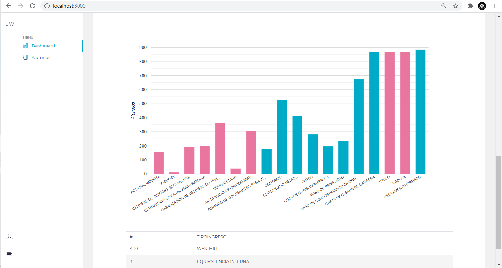

## REGISTRO DE ALUMNO

## REPORTES DE DOCUMENTACIÓN ENTREGADA POR ALUMNO

### `npm start`

Runs the app in the development mode. 
Open [http://localhost:3000](http://localhost:3000) to view it in the browser.